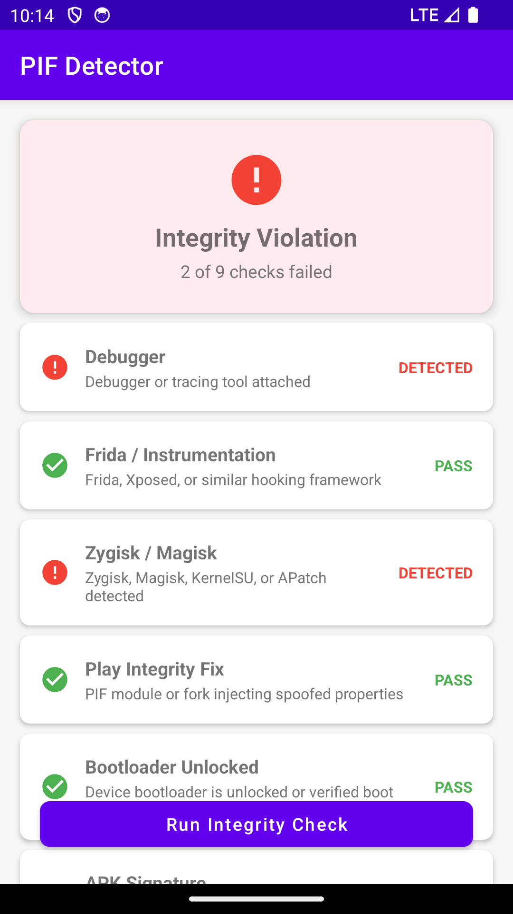
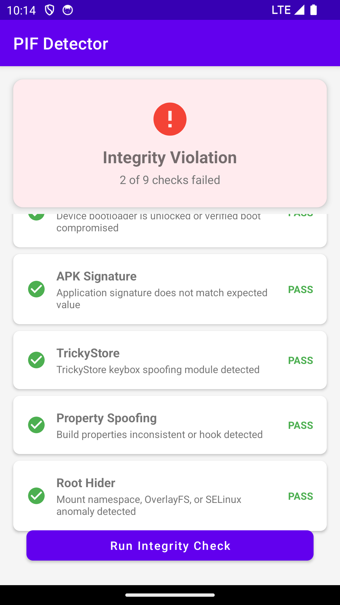

# PIF Detector


Detects [Play Integrity Fix](https://github.com/chiteroman/PlayIntegrityFix), [PlayIntegrityFork](https://github.com/osm0sis/PlayIntegrityFork), [TrickyStore](https://github.com/5ec1cff/TrickyStore), and similar tampering modules on Android. Native C++ detection engine with a custom bytecode VM, runtime string obfuscation, and Kotlin UI.

## Screenshots

<p align="center">
  
  
</p>

## What it detects

- **Play Integrity Fix** — maps scan for PIF classes & `InMemoryDexClassLoader` DEX regions, `custom.pif.prop`/`custom.pif.json`, module dirs, known props
- **TrickyStore** — `keybox.xml`, `target.txt`, `security_patch.txt` under `/data/adb/tricky_store/`, maps artifacts
- **Zygisk / Magisk / KernelSU / APatch** — maps scan for zygisk libs (incl. ReZygisk, ZygiskNext, Shamiko, NoHello), env vars, `rwxp` anomalies, module dirs
- **Root Hiders** — mount namespace divergence, OverlayFS on `/system`, SELinux context anomalies, elevated rwxp anonymous mapping count
- **Frida / Xposed** — unix socket scan, maps scan for gadget libs, port 27042 check, `gmain`/`gum-js-loop` thread names, parent process cmdline, Objection
- **Property Spoofing** — cross-validation of `ro.build.fingerprint` vs `ro.product.*`, security patch vs kernel date, property read timing analysis
- **Bootloader** — `ro.boot.verifiedbootstate`, `ro.boot.flash.locked`, `ro.boot.veritymode`, `vbmeta.device_state`, `ro.debuggable`, `ro.secure`, `sys.oem_unlock_allowed`
- **Debuggers** — `TracerPid` from `/proc/self/status`, `FLAG_DEBUGGABLE`
- **APK Tampering** — signing certificate hash pinned in native code

## How PIF bypasses integrity checks

PIF runs as a Zygisk module and:

1. Hooks `__system_property_read_callback` to spoof build properties (`ro.build.fingerprint`, `ro.build.version.security_patch`, etc.)
2. Injects `classes.dex` at runtime into `com.google.android.gms.unstable` via `InMemoryDexClassLoader`
3. Uses reflection to modify `android.os.Build` fields and inject a custom `KeyStoreSpi` provider
4. TrickyStore extends this by modifying key attestation certificate chains using stolen/leaked keybox files

## Architecture

`MainActivity.kt` triggers the native check via JNI. The native engine runs in two phases:

1. **Debug/instrumentation checks** run first (fail-fast): `isTraced()`, Frida VM + port/thread scan, parent process check, debuggable flag
2. **Tampering checks** run in randomized order each time: Zygisk VM, PIF VM, mount namespace, OverlayFS, SELinux, bootloader props, APK signature, TrickyStore paths, property consistency

The VM-based checks (Frida, Zygisk, PIF) use a custom bytecode interpreter with XOR-obfuscated opcodes — harder to hook than direct function calls. Sensitive strings are base64+XOR encoded and only decoded at runtime.

### Return value

The native function returns a bitmask — `0` means clean, any set bit indicates a detection:

```
0x001  DEBUGGER       0x010  BOOTLOADER      0x100  ROOT_HIDER
0x002  FRIDA          0x020  SIGNATURE
0x004  ZYGISK         0x040  TRICKYSTORE
0x008  PIF            0x080  PROP_SPOOF
```

## Build

```bash
./gradlew assembleDebug     # debug build
./gradlew assembleRelease   # release build (requires signing config)
./gradlew test              # run unit tests
./gradlew lintDebug         # run lint checks
```

Requires NDK r25+, Android Studio Hedgehog or later, SDK 35, Kotlin 2.0+.

> If you build from source with your own signing key, update `EXPECTED_SIG_HASH` in `native-lib.cpp`. See [CONTRIBUTING.md](CONTRIBUTING.md) for how.

## Requirements

- Android 7.0+ (API 24)

## Contributing

See [CONTRIBUTING.md](CONTRIBUTING.md).

## Contributors

| Name     | GitHub |
|----------|--------|
| Ir0nByte | [@IR0NBYTE](https://github.com/IR0NBYTE) |

## License

[GPL-3.0](LICENSE) — derivative works must stay open source.

> This tool is for defensive security research. Use it only on devices you own or have permission to test.
