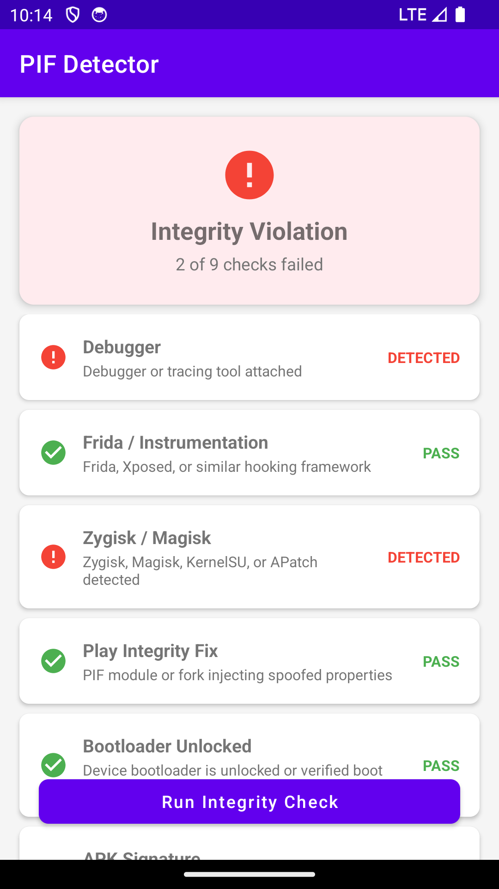
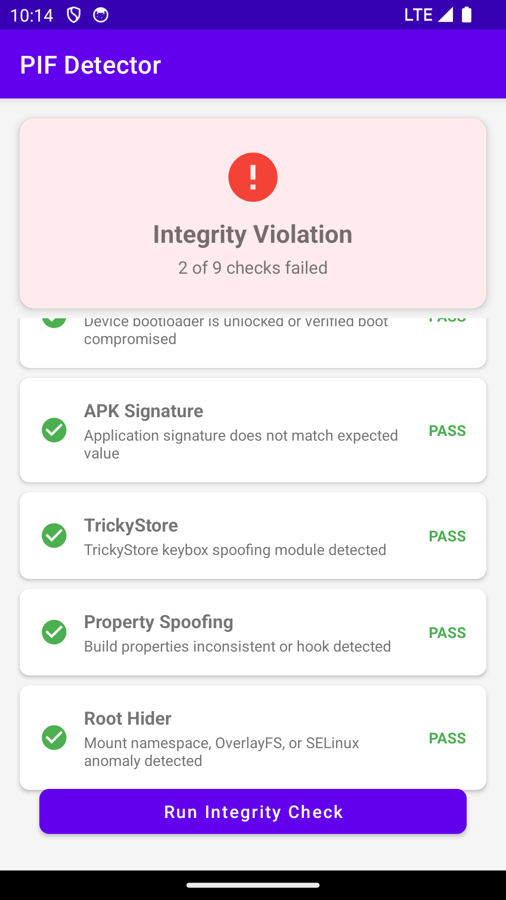

# PIF Detector


Detects [Play Integrity Fix](https://github.com/chiteroman/PlayIntegrityFix), [PlayIntegrityFork](https://github.com/osm0sis/PlayIntegrityFork), [TrickyStore](https://github.com/5ec1cff/TrickyStore), and the newer wave of bypass modules (inject-s companion streaming, autopif4 Canary fingerprints, TS-Enhancer-Extreme, PIF-Hybrid Rust edition, Treat Wheel root hider) on Android, plus passive and active hardware key-attestation validation that counters the 2026 STRONG-integrity keybox-spoofing stack. Native C++ detection engine with runtime string obfuscation and a Kotlin UI.

The load-bearing signal is key attestation. Every Zygisk PIF fork gates on the target process and unloads itself everywhere else, and the keybox spoofers hook `keystore2` rather than the calling app, so from an unprivileged `untrusted_app` there is nothing of them in our own address space to find. Checks that look for module names and paths are kept for privileged runs but are labelled honestly in the UI rather than counted as coverage. See [SELinux and the privilege boundary](#selinux-and-the-privilege-boundary).

## Screenshots

<p align="center">
  
  
</p>

## What it detects

- **Play Integrity Fix:** maps scan for PIF classes & `InMemoryDexClassLoader` DEX regions, `custom.pif.prop`/`custom.pif.json`, module dirs, known props
- **PIF Companion Streaming (inject-s v4.5):** Zygisk companion IPC sockets, memfd-backed dex regions, module installed without `pif.json`
- **Pixel Canary Fingerprint (autopif4):** monthly Canary build IDs, vendor partition / `ro.build.id` mismatch, brand vs fingerprint cross-check
- **PIF Pure Rust (PIF-Hybrid):** module.prop markers ("Pure Rust Edition", "zero DobbyHook", "Enginex0"), Rust crate libs in maps
- **Keybox spoofers (TrickyStore, TrickyStoreOSS, TEESimulator, OhMyKeymint, ForgeStore, KeyboxHub):** `keybox.xml`, `target.txt`, `security_patch.txt` under `/data/adb/tricky_store/`, plus the August 2026 wave that stopped hand-building certificates and started running a real KeyMint instead: TEESimulator v4 (`/data/adb/teesim`, vendors AOSP's Rust KeyMint reference TA inside `keystore2`), OhMyKeymint (`/data/misc/keystore/omk`), ForgeStore, and KeyboxHub auto-rotation paths
- **FS-Enhancer-Extreme (was TS-Enhancer-Extreme):** anti-detection module that masquerades the bootloader as locked. Renamed in July 2026 and the config directory moved with it, so the current deployment is `fs_enhancer_extreme`; the old `ts_` paths are kept for legacy installs but no longer match a current one, and the new version in fact lists `ts_enhancer_extreme` in its own conflict-module table and disables it
- **Zygisk / Magisk / KernelSU / APatch:** maps scan for zygisk libs (incl. ReZygisk, ZygiskNext, Shamiko, NoHello, and Vector, the maintained LSPosed successor), env vars, `rwxp` anomalies, root-manager packages via `PackageManager` (Magisk + KernelSU + APatch + classic SuperSU/Koush/Kingo + cloakers), su binary paths (incl. `/system_ext/bin/su` on A11+), busybox, legacy SuperUser/SuperSU APKs in `/system`
- **Root Hiders:** mount-table analysis of `/proc/self/mountinfo` (a tmpfs shadowing a read-only system partition whose mount source is not `tmpfs`, and binds whose mount root lives under `/adb` on the userdata device, which also leaks the module directory name), OverlayFS on `/system`, elevated rwxp anonymous mapping count. The older mount-namespace diff against `/proc/1/mounts` was removed: `/proc` is mounted `hidepid=invisible` and the app is not in gid 3009, so that comparison could never run unprivileged and failed open silently. There is no SELinux check in the engine; earlier wording here claimed one.
- **Treat Wheel:** closed-source "Shamiko for ReZygisk" root hider (written in C to dodge `__cxa_atexit` unload detection); `/proc/self/maps` scan for the `treat_wheel/zygisk/` module mapping
- **Key Attestation Anomaly:** generates an attested EC key in `AndroidKeyStore` and runs several low-false-positive checks. (1a) Cryptographically validates the certificate chain link by link, and requires every certificate that issues another to actually be a CA. Both run before a single byte of the attestation extension is parsed, because the extension is the only attacker-written input here. The `basicConstraints` half matters on its own: a genuine attested key is an end-entity certificate whose private key the attacker holds, so without it they can sign a forged leaf with a real one and hand back a chain that verifies link by link and terminates at a real Google root. A signature algorithm the platform cannot even name counts as a broken link rather than as an unchecked one, since that OID is theirs to write. (anti-replay) Verifies the attestation echoes the random challenge nonce we passed, defeating cached and replayed certs. (1b) Parses the attestation `RootOfTrust` (`deviceLocked`/`verifiedBootState`) and flags a contradiction when it claims a locked/verified device while the engine's own root-hider signals prove tampering. (1b') Flags the reverse and more common arrangement: the boot properties claim a locked, verified device while the hardware attestation says it is unlocked. `ro.boot.verifiedbootstate`, `ro.boot.flash.locked` and the rest are ordinary properties and every resetprop module rewrites them, but the `RootOfTrust` is signed by the TEE and the chain is anchored to a pinned Google root, so a module that is not actively forging attestation for this uid cannot reach it. When the two disagree the properties are the ones lying. Gated on a chain that positively parsed as TrustedEnvironment or StrongBox and anchored to a pinned root, so the RootOfTrust is only trusted when it is provably the TEE's. It cannot false-positive: an honest device reports the same state in both places, whether locked or unlocked, and only a disagreement flags. (1c) Anchors the chain to Google's hardware-attestation roots (RSA valid through 2042 and ECDSA P-384 valid through 2035, SHA-256-pinned offline). Chains that report `attestationSecurityLevel = Software` are exempt from anchoring, because those are signed by the public AOSP software attestation key, which is deliberately not pinned, so emulators, GSI images and AOSP builds fail anchoring while being completely clean. That exemption is no longer unconditional: it holds only while the device does not also present as production hardware with a declared hardware-backed keystore, which is what the separate Software Attestation check tests. A stock Android Studio AVD attests at software level under the AOSP software root while reporting `user`/`release-keys` and a Google brand, which is exactly the free pass the old blanket exemption granted. (1d) For a Google-anchored chain, checks each cert serial against Google's revocation list in both encodings, since that list mixes decimal-keyed and hex-keyed serials. The check runs on every run against a bundled offline snapshot of the list, so it needs no network; an optional online refresh, on by default and behind a first-run notice, picks up serials published since the snapshot was made. Trust anchors are skipped before the lookup, because a revoked root would be a fleet-wide CA event rather than evidence about one device. Fails safe throughout: absence of attestation, parse failure, or an unrecognised root never flags, and a run that can consult neither the snapshot nor the network reports UNVERIFIED rather than a pass. A clean result means not known-bad; see docs/COVERAGE.md.
- **Attestation Forgery (active):** rather than inspecting whatever chain a spoofer chooses to hand back, this asks for keys that are awkward to forge and catches the answer contradicting itself. It requests a `PURPOSE_ATTEST_KEY` key, which TrickyStoreOSS forges for **any** caller because that arm of its force-forge condition carries no uid gate, so the forgery is provoked even when the detector is not in the module's `target.txt`. It also requests an auth-bound key with a SHA-512 digest, which surfaces two more contradictions: a leaf signed with the digest we asked for rather than the batch key's fixed SHA-256, and an authorization list asserting `NO_AUTH_REQUIRED` (tag 503) for a key that plainly requires authentication while omitting tags 504/505. The tag-503 half now fires on nothing current and is retained only for the TEESimulator v3 line and older installs: TrickyStoreOSS made that tag conditional on 2026-07-31, sixteen hours after the v2.5 release, and the KeyMint reimplementations emit it honestly. It is recorded here rather than quietly left in place, because a check whose description claims coverage it no longer has is exactly the failure this project keeps auditing for. A single self-signed certificate carrying an attestation extension is caught too. When the passive probe has already flagged, the anchoring half is suppressed so a device with no hardware attestation is reported once rather than twice.
- **Frida / Xposed:** TCP connect probe to `127.0.0.1:27042` and `:27043`, maps scan for gadget libs, `gmain`/`gum-js-loop` thread names, parent process cmdline (this one reads `/proc/<ppid>/cmdline` and fails open under `hidepid`, exactly like the legacy `/proc/net/tcp` scan below), Objection. The TCP probe replaces the legacy `/proc/net/tcp` scan, which Android 10+ filters to empty for `untrusted_app`.
- **Property Spoofing:** cross-validation of `ro.build.fingerprint` vs `ro.product.*`, board (a device claiming to be a Pixel whose kernel reports non-Google silicon; gated on the device claiming to be Google, because the board list is matched by substring and several Pixel codenames are ordinary words that collide with other OEMs' board strings), property read timing, and build-identity self-contradiction. PIFork, inject-s and FS-Enhancer-Extreme all globally reset `ro.build.type` to `user` and every `ro.*.build.tags` to `release-keys`, but none of them rewrites a fingerprint property globally, because fingerprint spoofing lives in their Zygisk layer and that only loads inside GMS and the Play Store. A genuine fingerprint always ends in `:<build_type>/<tags>`, so the scalars disagreeing with it proves something rewrote them after the image was built. The check is directional and only fires when the scalars claim a clean production build, which makes it inert on both genuine user builds and genuine userdebug builds. It therefore only catches this on a device whose ROM is really userdebug or eng.
- **Bootloader:** `ro.boot.verifiedbootstate`, `ro.boot.flash.locked`, `ro.boot.veritymode`, `vbmeta.device_state`, `ro.debuggable`, `ro.secure`, `sys.oem_unlock_allowed`
- **Debuggers:** `TracerPid` from `/proc/self/status`, `FLAG_DEBUGGABLE` (release builds only)
- **APK Tampering:** SHA-256 of the signing cert obtained via `PackageManager.GET_SIGNING_CERTIFICATES` (API 28+), compared against a digest injected at build time. Skipped in debug builds, and in release builds when no digest is supplied. See [Build](#build).

## How PIF bypasses integrity checks

PIF runs as a Zygisk module and:

1. Hooks `__system_property_read_callback` to spoof build properties (`ro.build.fingerprint`, `ro.build.version.security_patch`, etc.)
2. Injects `classes.dex` at runtime into `com.google.android.gms.unstable` via `InMemoryDexClassLoader`
3. Uses reflection to modify `android.os.Build` fields and inject a custom `KeyStoreSpi` provider
4. TrickyStore extends this by modifying key attestation certificate chains using stolen/leaked keybox files

Newer forks add: streaming the dex payload over a Zygisk companion IPC channel (no on-disk JSON, defeats config-file scans); rotating monthly Pixel Canary fingerprints from automation; pure-Rust rewrites that ditch DobbyHook and so escape libdobby signature scans; and TS-Enhancer-Extreme, which actively patches `VerifiedBootHash` and security-patch props to make the bootloader look locked.

## Architecture

`MainActivity` is UI-only. `DetectionRunner` owns the worker executor and the JNI binding to the native engine. The native engine runs in two phases:

1. **Debug/instrumentation checks** run first (fail-fast): `isTraced()`, Frida TCP-connect probe and thread scan, parent process check, debuggable flag (release only)
2. **Tampering checks** run in randomized order each time: Zygisk maps scan plus PackageManager root-app probe and su-binary scan, PIF side-effect probe, companion-streaming probe, mount-table analysis, OverlayFS, bootloader props, APK signature, TrickyStore paths, property consistency, Pixel Canary fingerprint, TS-Enhancer-Extreme, PIF Pure Rust, Treat Wheel

The native engine needs a `Context` for the three checks that touch the framework (root-manager package probe, debuggable flag, APK signature), so `isIntegrityTampered` takes one explicitly. It previously received the `DetectionRunner` instance instead, which under CheckJNI aborts the process and without it is undefined behaviour that made all three silently fail open.

After the native call returns, `DetectionRunner` runs the **passive key-attestation probe** (`KeyAttestationProbe`, written in Kotlin because the `AndroidKeyStore` attestation API lives in Java land) and ORs `ATTEST_ANOMALY` into the bitmask, then the **active probe** (`ActiveAttestationProbe`) which ORs `ATTEST_FORGERY`. The active probe is told whether the passive one already flagged, so a device with no hardware attestation at all is not reported twice for one cause. Its contradiction check reuses the root-hider bit the native engine already computed; its chain-anchor check uses the SHA-256-pinned Google roots in `AttestationRoots`. The offline revocation check runs unconditionally against a snapshot bundled in the APK; only the online refresh is behind a toggle, which defaults to on after a first-run notice. The probe is split into hard trust gates that return early (chain crypto, CA issuers, anchoring, challenge echo) and an accumulate phase that ORs the remaining findings together, so one finding no longer suppresses the checks that follow it. The flag bit is still registered in `nativeAllFlagsMask()` so the SSOT assertion holds; the pure validation/parse/anchor logic is isolated in `AttestationAnalysis` and unit-tested (including against real Google attestation bytes and the pinned root fingerprints). A third probe, `KeystoreBoundaryProbe`, asks for two request shapes the KeyMint HAL defines and ORs `ATTEST_FORGERY` as well: a key generated with no attestation challenge, which must come back as a self-signed certificate with no attestation record, and a challenge one byte past the documented 128 byte maximum, which must be refused. Its decision table lives in `KeystoreBoundary`, which is Android-free and unit-tested, so the probe only has to observe. A fourth probe, `AttestedIdentityProbe`, provokes two records and compares which identifier tags they carry: an ordinary attestation asks for no identifier, and Tag.aidl says every identifier tag "must be set only when requesting attestation of the device's identifiers", so an identifier in that record is one the keystore volunteered. The second record comes from `setDevicePropertiesAttestationIncluded(true)`, where the honest answers are a refusal or an acceptance whose identifiers the secure environment vouched for. It deliberately does not compare the attested values against `Build.BRAND` and friends: see docs/COVERAGE.md for why that documented rule is contradicted by the framework that implements it. Its table lives in `AttestedIdentity`, also Android-free and unit-tested. A fifth probe, `StrongBoxProbe`, asks the device three separate times whether it has a secure element and ORs `ATTEST_FORGERY` when the answers disagree: the feature list, keystore2 when asked for a StrongBox key, and the level the keystore and the attestation record state for an ordinary one. The first two arms need no reading of any document, because once keystore2 has answered that it has no StrongBox instance, anything else on the device coming back labelled StrongBox is the device contradicting itself in one run. That answer is a platform answer rather than a framework one: there is no `hasSystemFeature` test in the generate path, so the refusal comes from the registered KeyMint instances. A refusal is never a finding, because a genuine device can be out of remotely provisioned keys, and the StrongBox request deliberately carries no attestation challenge so that nothing but the hardware's absence can make it fail. It also asks the one thing a KeyMint secure element has to refuse: `IKeyMintDevice.aidl` says a StrongBox "must only support 128 and 256-bit keys" for AES, and nothing in the framework pre-empts the request, so a 192 bit StrongBox AES key that is accepted rather than refused is reported. That arm is gated on the device's `strongbox_keystore` feature version reaching 100, because the restriction does not exist before KeyMint: the Keymaster 4.0 HAL has no StrongBox AES clause at all, and a stock Samsung SM-G780G at feature version 4 accepts the key while a Pixel 7a at 300 refuses it. Its table lives in `StrongBoxCheck`, also Android-free and unit-tested. These are the only detection signals produced outside the native engine.

Sensitive strings are base64+XOR encoded and only decoded at runtime. An earlier obfuscation VM was removed in v2.4: its rolling-key decoder desynced on every taken jump, so all three VM-backed checks always returned false. Its unique needles were folded into the direct scanners before the VM was deleted.

JNI helpers use a `LocalRef<T>` RAII wrapper for ref hygiene, and security checks (signature, debuggable) fail closed: any JNI lookup error fires the detection bit so a hooked-JNI environment can't suppress it.

### SELinux and the privilege boundary

`untrusted_app` on Android 10+ cannot read `/proc/net/tcp` (filtered to empty) or `access()` paths under `/data/adb/*` (denied). Detectors that target those signals use alternatives: TCP connect probes for ports, `PackageManager` for root managers, and in-process `/proc/self/maps` for module presence.

The boundary is wider than the filesystem, and it decides what this app can honestly claim:

- **The PIF forks are not in our process.** Both PIFork and inject-s gate on `app_data_dir` ending in `/com.google.android.gms` or `/com.android.vending` and call `DLCLOSE_MODULE_LIBRARY` in every other process. FS-Enhancer-Extreme has no Zygisk component at all. A maps scan for them cannot match.
- **The keybox spoofers are not in our process either.** TrickyStoreOSS and ForgeStore ptrace-inject into `keystore2` and hook `ioctl` there. Their effect reaches us only through the attestation chain.
- **The kernel's own copy of boot state is unreadable.** `ro.boot.*` derives from `androidboot.*`, and no module touches `/proc/cmdline` or `/proc/bootconfig`, so the contradiction is real but out of reach: AOSP sepolicy grants `proc_cmdline` and `proc_bootconfig` to no app domain. `/sys/fs/selinux/enforce` carries an explicit `neverallow` for untrusted apps, `/proc/version` is denied, and `/system/build.prop` is mode 0600. `/proc/cpuinfo` is the one kernel-exposed source apps may still read, which is why the SoC cross-check works.

Five flags therefore cannot fire unprivileged: `PIF`, `TRICKYSTORE`, `PIF_STREAM`, `TSEE` and `PIF_RUST`. They are retained because they do fire when the app runs with root or adb, but the UI renders them as **NOT OBSERVABLE** in grey rather than a green pass, and excludes them from the summary count, so the result list never implies coverage the sandbox forbids. `TREAT_WHEEL` is deliberately not in that set: it is a ReZygisk root hider that loads into every app process including ours, so its in-process scan genuinely fires.

### Return value

The native function returns a bitmask: `0` means clean, any set bit indicates a detection.

```
0x0001  DEBUGGER          0x0040  TRICKYSTORE       0x0400  CANARY_FP
0x0002  FRIDA             0x0080  PROP_SPOOF        0x0800  TSEE
0x0004  ZYGISK            0x0100  ROOT_HIDER        0x1000  PIF_RUST
0x0008  PIF               0x0200  PIF_STREAM        0x2000  TREAT_WHEEL
0x0010  BOOTLOADER                                  0x4000  ATTEST_ANOMALY
0x0020  SIGNATURE                                   0x8000  ATTEST_FORGERY
```

Flag values are owned by the native side; `DetectionRunner.verifyFlagsInSync()` asserts at startup that the Kotlin mirrors match `nativeAllFlagsMask()`.

## Reading a result

Each check reports one state rather than a pass or fail: detected, reported (a real
observation that cannot convict on its own), unverifiable (it tried and reached no verdict),
skipped (a precondition failed), not observable (this device cannot produce the evidence) or
pass. Only detected counts as a finding, and only observable rows count towards the pass
total, so the summary never claims coverage the sandbox or the hardware forbids.

Rows that have evidence carry a chevron. Tapping one shows what the engine actually saw: the
detail line and, where the check is wired for them, the reason lines naming which sub-probe
fired, such as `ro.boot.flash.locked is zero` rather than just a lit row.

The overflow menu exports a plain-text report with every check, its state, its reasons, an
attestation summary, the bundled revocation snapshot date and the build identity. It is meant
to be attached to an issue. It deliberately carries no certificate serials, no attestation
challenge and no certificate bytes, and a test fails if any of those appear.

## Build

```bash
./gradlew assembleDebug     # debug build (signature check skipped)
./gradlew assembleRelease   # release build (requires signing config)
./gradlew test              # run unit tests
./gradlew lintDebug         # run lint checks
```

Requires NDK r25+, Kotlin 2.0+, and a JDK 17 toolchain. Gradle 8.11.1 rejects JDK 25 with a bare `What went wrong: 25.0.2`, and recent Android Studio builds now bundle a JDK 25 JBR, so point `JAVA_HOME` at a standalone 17 rather than the IDE's runtime.

The manifest declares `INTERNET` (used by the Frida TCP probe and the attestation revocation refresh, which is on by default behind a first-run notice and can be turned off) and a `<queries>` block listing root-manager package names (Android 11+ visibility requirement). That list has to match the package list the native engine probes: from API 30 an undeclared package is invisible, `getPackageInfo` throws, and the probe cannot tell that apart from the package being absent, so the detection would go quiet with nothing failing. `RootManagerQueriesSyncTest` reads both files and fails the build if they drift.

`compileSdk` is 36 while `targetSdk` stays at 35. targetSdk 36 opts into Android 16's enforced edge-to-edge, which this layout does not yet handle: the action bar draws under the status bar and the run button sits under the navigation bar. Instrumented tests do not catch it, because the views are still reported as displayed and are merely overlapped. Bumping it needs the window-inset work done and confirmed visually on an API 36 image first.

R8 keeps the native methods with `-keepclasseswithmembers`, not `-keepclasseswithmembernames`. The names variant preserves naming but still allows shrinking, and `nativeSelfTest` is reachable only from the instrumented test, so a release build dropped it, `RegisterNatives` failed on the missing method, and the library refused to load. Registration is all or nothing, so one shrunk method takes the whole engine down.

The APK signature check pins the release signing certificate. Supply its digest through the environment at build time:

```bash
export RELEASE_CERT_SHA256=$(keytool -list -v -keystore <ks> -alias <alias> \
  | grep SHA256: | sed 's/.*SHA256: //' | tr -d ':' | tr 'A-Z' 'a-z')
./gradlew assembleRelease
```

Leave it unset and the check compiles out, exactly as it does for debug builds. It used to be a constant in `native-lib.cpp`, which silently pinned every release to whichever machine last edited the file; because the check is fail-closed, a build signed with any other key then reported its own signature as tampered on every device. Absent is safer than wrong.

## Requirements

- Android 7.0+ (API 24)

## Contributing

See [CONTRIBUTING.md](CONTRIBUTING.md).

## Contributors

| Name     | GitHub |
|----------|--------|
| Ir0nByte | [@IR0NBYTE](https://github.com/IR0NBYTE) |

## License

[GPL-3.0](LICENSE). Derivative works must stay open source.

> This tool is for defensive security research. Use it only on devices you own or have permission to test.

